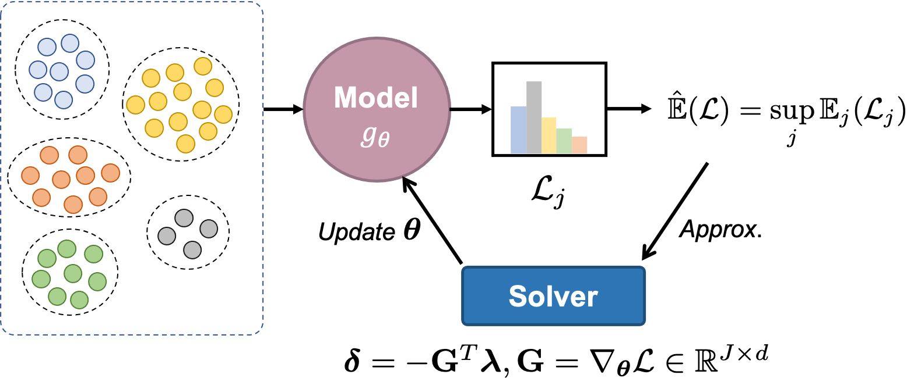
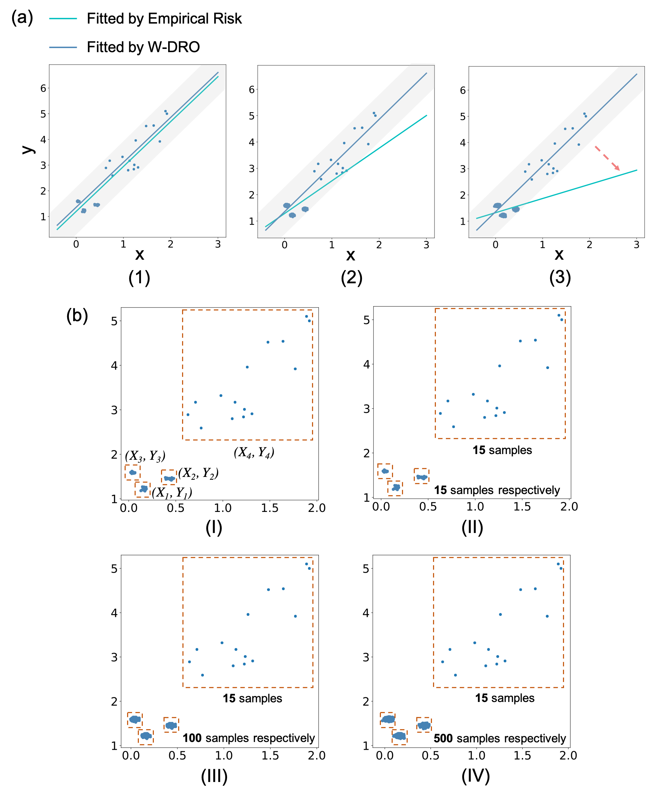

<center>

# WDRO
The implementation on Towards Scalable and Fast Distributionally Robust Optimization for Data-Driven Deep Learning.

****

We formalize the learning problem with the supremum of a family of  *subgroup-level* loss functions. Subgroup loss is the cost function of partitioned uncertainty set. Then we implement the maximum of subgroup loss as the objective function and update model parameters by reweighting the descent direction, calculated from a differentiable objective function:

<center>


***Prerequisites:***

```
tensorflow-gpu-1.13.1
cvxopt-1.2.5
numpy-1.15.0
pandas-0.25.2
```


#### Toydata:

A regression example. A toy dataset contains four subgroups. 

```
python WDRO_for_toydata.py
```

<center>


#### Implemtation:  

1, DNN+WDRO:


```
python 10-nonlinearized-dual.py --num_of_group 4 --num_minor 2 --train_subgroup_batch 100
```
Here,  
--num_of_group : total subgroup number $N$ ;    
--num_minor    : number of minor-class subgroup $c$ ;      
--train_subgroup_batch : number of data in each subgroup $s_j$ ;   


2, ResNet+WDRO:

```
python nonlinearized-dual-ResNet.py --num_of_group 4 --num_minor 2 --train_subgroup_batch 100
```

The label now is "eyeglasses" in CelebA dataset, which can be changed in data_process.py. 


## Acknowledgements

This work is supported by UniDT's Cognitive Computing and Few Shot Learning Project. This repository can only be used for personal/research/non-commercial purposes. 
